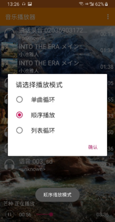
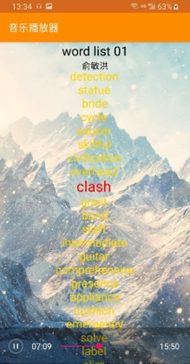

# 安卓原生音乐播放器

## 项目简介

程序主要分为显示歌曲列表模块、歌曲播放模块和歌词滚动模块组成。

**显示歌曲列表模块功能**：主要功能是根据Android音频库的URI获取系统中所有的音频文件信息然后显示在页面上。

**歌曲播放模块功能**：主要显示用户点击列表中的歌曲后实现歌曲的播放功能，以及暂停播放功能。用户退出程序后，歌曲依旧可以播放。并且实现用户可以根据控制条控制歌曲的播放，以及实现用户选择的播放模式。

**歌词滚动模块功能**：根据获取的歌词文件，实现歌词的滚动显示效果（主要读取LRC格式文件）。

## 开发环境

操作系统：**Microsoft Windows 10**

IDE：**Android Studio 3.5**

Java版本：**JDK 8** *211*

## 项目文件结构

| 文件夹/文件                         | 解释                                   |
| ----------------------------------- | -------------------------------------- |
| **adapter**                         | **歌词列表的适配器类**                     |
| MediaListAdapter.java               | 歌词列表的适配器                       |
| **bean**                            | **用于存放音频文件和歌词文件的实体类** |
| LrcContent.java                     | 歌词实体类                             |
| MediaInfo.java                      | 歌曲实体类                             |
| **task**                            | **音轨播放线程类**                     |
| AudioPlayTask.java                  | 音轨播放任务，主要用于播放wav格式音频  |
| **util**                            | **工具类的包**                         |
| DateUtil.java                       | 转换日期格式工具类                     |
| MediaUtil.java                      | 主要获取音频文件格式和播放时长工具类   |
| NotifyUtil.java                     | 构造通知的工具类                       |
| 在**com.example.musicplayer**下的类 |                                        |
| DetailActivity.java                 | 歌曲详情页面                           |
| MainActivity.java                   | 主页面，显示歌词列表                   |
| MainApplication.java                | 放置全局音频播放器                     |
| MusicService.java                   | 音频播放服务类                         |
| **res/layout**                      | **布局相关**                           |
| activity_detail.xml                 | 歌曲详情页面布局文件                   |
| activity_main.xml                   | 主页面布局文件                         |
| item_media.xml                      | 歌词列表单个选择布局效果               |
| notify_music.xml                    | 通知布局文件                           |

## 项目截图

+ 主界面

+ 添加歌曲功能和选择播放模式

+ 歌词滚动效果

+ 手机任务栏效果

> 该项目为本人本科学习期间的安卓课程作业，项目总体而言相对简略。。。(本人花了几天时间完成，中间还要完成其他课程的大作业😂)

> 项目开发于：2019年12月
